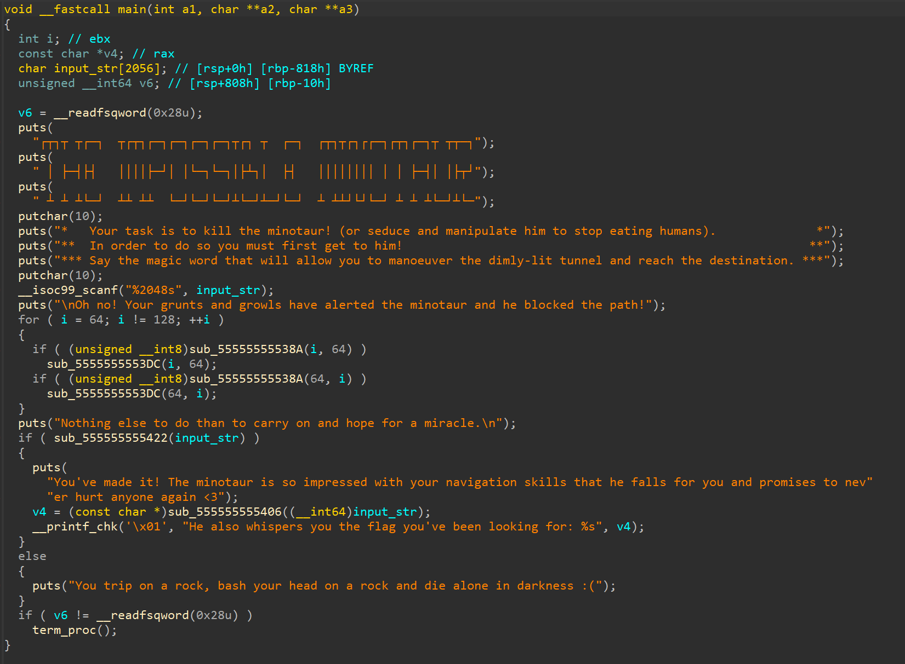
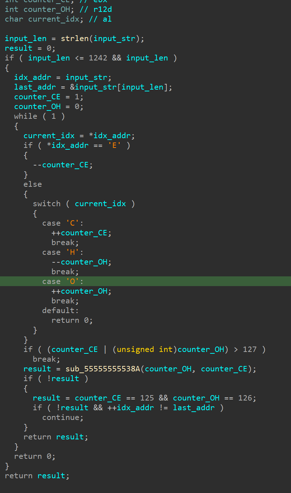
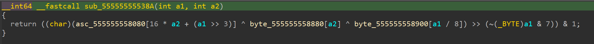
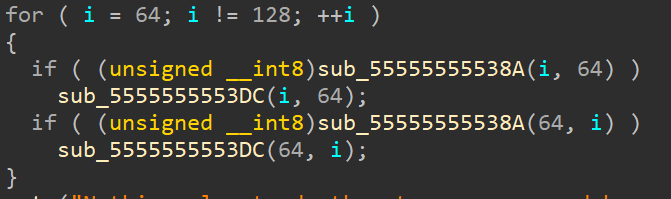
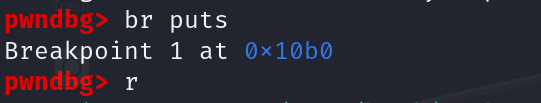
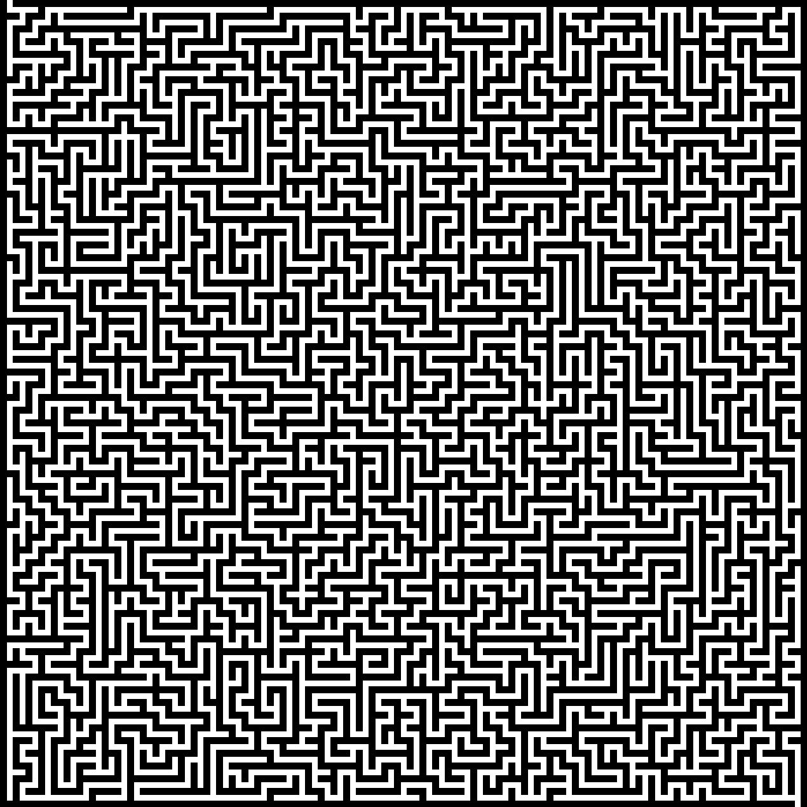
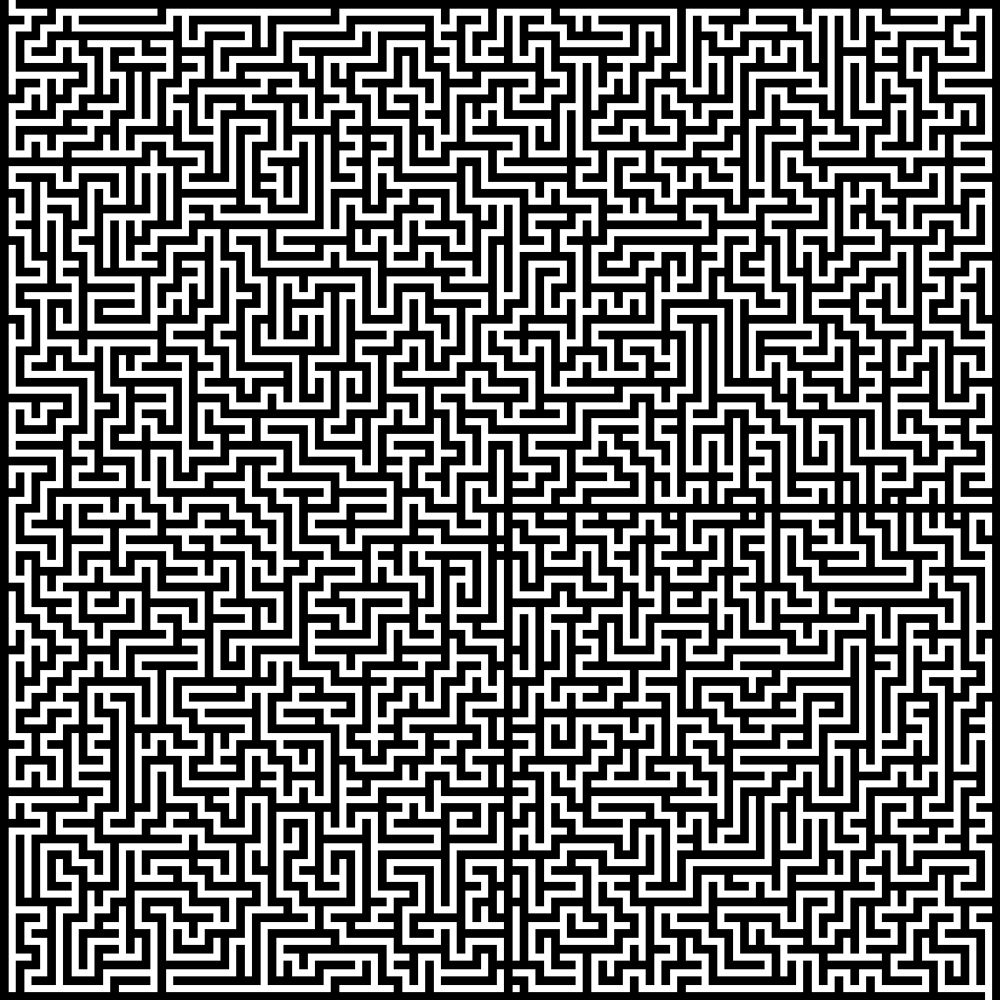
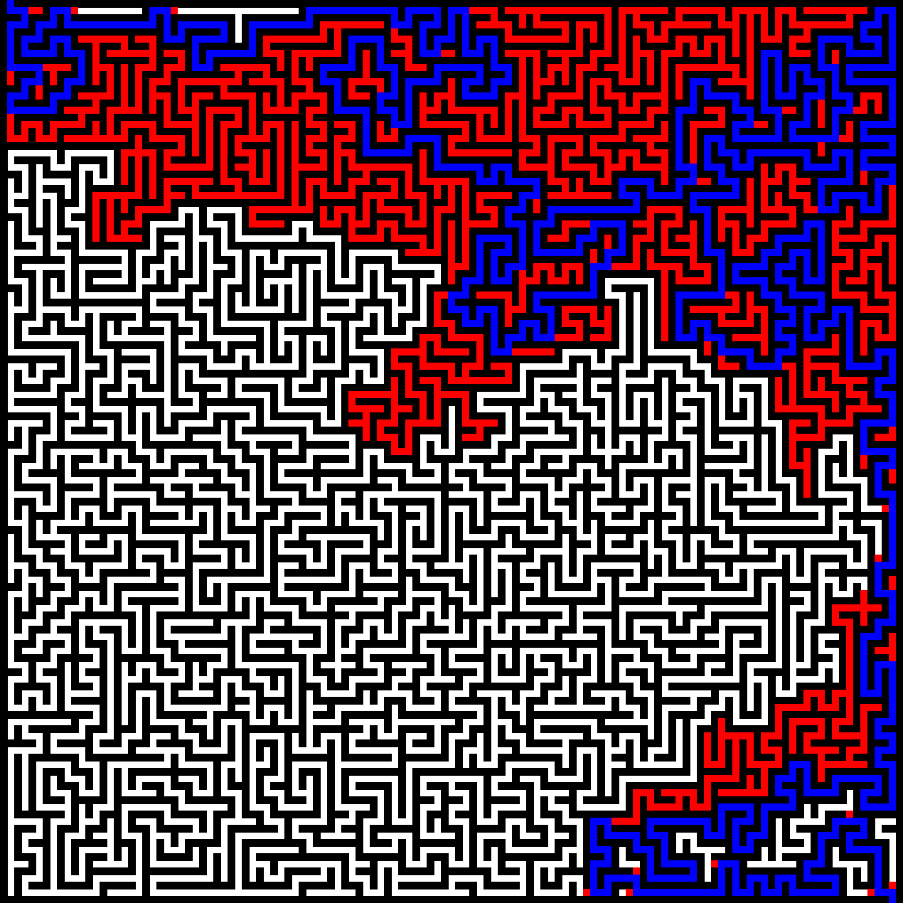
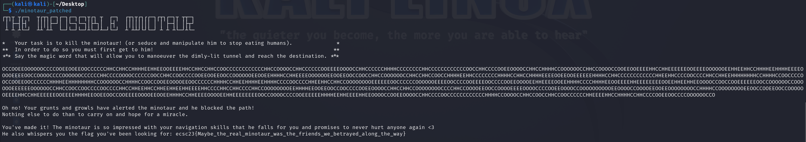

# The Impossible Minotaur
## Intro


in order to solve this challenge player must input correct string. This string must match sequence that is the from the beginning of later presented maze.
The input is later checked in function at the address 0x555555555422



we are given 4 options to move:
- E to decrease x
- C to increase x
- H to decrease y
- O to decrease y
at least in orientation i chose to follow
returns 0 if either x or y is less than 0 or if we hit a wall that is decrypted from func from addres 0x55555555538A



this function decrypts if there is a wall at certain x, y
we will later use that function to generate maze layout
function returns 1 if we end up at the end of maze that is at 125, 126

another thing that has to be done in order to complete it is we have to patch the program to always ignore output of this function because it does create wall that separates exit from the rest of the maze



while one might think that we should just call a function that reveals the flag that is not possible since flag is decrypted using out input.
## Actual solve
to get a maze layout we use gdb and set breakpoint before any other instruction
in this case i just set breakpoint on puts since it is the first func that executes



after that we can use script that calls function 0x000055555555538A that checks if there is a wall at location x, y
```python
import gdb

function_call_template = '((int (*)(int, int))0x000055555555538A)({a}, {b})'
matrix_size = 127
result_matrix = [['0' for _ in range(matrix_size)] for _ in range(matrix_size)]

for a in range(matrix_size):
    for b in range(matrix_size):
        gdb_command = function_call_template.format(a=a, b=b)
        gdb_output = gdb.execute('p ' + gdb_command, to_string=True).strip()

        try:
            result = int(gdb_output[-1])
        except ValueError:
            result = 0

        if result == 1:
            result_matrix[a][b] = '1'

print(result_matrix)
```


what this gives us is a 127x127 2d list with 0 where there is a wall and 1 where there is not
then we use another python script to turn this maze into actual image
```python
from PIL import Image, ImageDraw

with open('maze_2.txt', 'r') as f:
    content = f.read()

maze = []
content = content.split(']')
for line in content:
    temp_list = []
    for element in line:
        if element == '0':
            temp_list.append(0)
        elif element == '1':
            temp_list.append(1)
    maze.append(temp_list)

color_wall = (255, 255, 255)  # white
color_path = (0, 0, 0)        # black

cell_size = 10
maze_size = len(maze[0])
image_size = maze_size * cell_size

image = Image.new('RGB', (image_size, image_size), color_wall)
draw = ImageDraw.Draw(image)

for i in range(maze_size):
    for j in range(maze_size):
        x1, y1 = j * cell_size, i * cell_size
        x2, y2 = x1 + cell_size, y1 + cell_size
        if maze[i][j] == 0:
            draw.rectangle([x1, y1, x2, y2], fill=color_path)

image.show()
image.save('maze_2_py.png')
```
output:


we do the same with breakpoint set after program cuts our way which gives us this output:



as you can see there is no way to solve this maze without a patch
we use [Maze Solver (esstudio.site)](https://esstudio.site/maze-solver/)
to solve maze from picture nr 1 which gives us this output:



now we need a way to translate that to a string that contains directions as written above
i wrote yet another python script for that
```python
from PIL import Image

maze = Image.open('maze_solved.png')
rgb_maze = maze.convert('RGB')


def get_pixel_at_index(x, y):
    if x < 0 or y < 0 or x >= 127 or y >= 127:
        return False
    return rgb_maze.getpixel((x * 10 + 5, y * 10 + 5)) == (0, 0, 255)


current_node = (1, 0)
visited_nodes = [current_node]
directions = ''
while True:
    x, y = current_node
    if get_pixel_at_index(x, y - 1) and (x, y - 1) not in visited_nodes:
        current_node = (x, y - 1)
        directions += 'H'
    elif get_pixel_at_index(x, y + 1) and (x, y + 1) not in visited_nodes:
        current_node = (x, y + 1)
        directions += 'O'
    elif get_pixel_at_index(x - 1, y) and (x - 1, y) not in visited_nodes:
        current_node = (x - 1, y)
        directions += 'E'
    elif get_pixel_at_index(x + 1, y) and (x + 1, y) not in visited_nodes:
        current_node = (x + 1, y)
        directions += 'C'
    visited_nodes.append(current_node)
    if current_node == (125, 126):
        break
print(directions)

```
that gives us output of ```
```txt
OCCOOEEOOOOOOCCCCOOEEOOEEOOCCCCCCHHCCHHCCHHHHEEHHEEOOEEEEHHCCHHCCHHCCOOCCCCCCCCCCCCHHCCOOOOCCHHCCCCCCOOEEEEOOOOCCHHCCCCCCHHHHCCCCCCCCHHCCCCCCCCCCCCOOCCHHCCCCOOEEOOOOCCHHCCHHHHCCOOOOOOCCHHCCOOOOCCOOEEOOEEEEHHCCHHEEEEEEOOEEEEOOOOOOEEHHEEHHCCHHHHEEHHHHEEEEOOOOEEEEOOCCOOOOCCCCOOOOOOCCCCCCHHCCCCOOOOCCCCCCOOCCHHCCOOCCCCOOEEOOEEOOCCOOOOOOEEOOEEHHHHCCHHEEEEOOOOOOEEOOEEOOCCOOCCHHCCOOOOOOCCHHCCHHCCOOCCHHHHEEHHCCCCCCCCHHHHCCHHCCHHHHEEEEOOEEOOEEEEEEHHHHCCHHCCCCCCCCCCCCHHEEHHCCCCOOCCCCHHCCHHEEHHHHHHHHCCHHHHCCOOCCCCOOCCOOEEOOCCCCCCHHHHEEHHHHHHHHCCOOOOOOCCHHHHCCOOCCOOEEOOOOEEOOCCCCCCHHHHCCHHEEHHHHEEHHHHCCCCOOCCCCHHEEHHCCHHCCOOOOOOOOEEEEEEOOCCCCCCOOOOOOEEEEOOCCCCOOEEEEOOCCCCOOEEOOOOEEHHEEEEOOEEHHHHCCCCHHHHEEOOEEEEHHEEEEEEEEOOEEHHEEHHEEOOOOCCOOCCOOEEEEEEOOCCOOOOOOCCOOOOOOEEEEEEOOOOOOCCHHCCOOCCOOCCCCOOCCCCHHCCHHEEHHCCHHEEHHEEHHEEEEHHCCCCHHCCHHCCCCHHCCOOOOOOOOEEHHHHEEOOEEOOCCOOCCCCOOEEOOOOCCHHCCHHCCOOOOOOOOCCCCHHCCOOOOEEOOCCOOOOEEEEOOOOCCCCOOEEOOOOCCOOOOOOOOOOEEOOOOCCOOOOEEOOEEOOOOOOOOCCHHHHCCOOOOOOOOEEOOCCOOEEOOCCOOOOOOEEEEHHCCHHEEEEEEOOEEEEHHHHEEOOEEOOCCOOEEEEOOOOEEOOEEHHHHCCHHEEEEOOOOEEHHEEEEEEEEOOCCOOOOCCCCOOEEEEEEHHHHEEHHEEEEHHEEOOOOCCOOEEOOOOCCHHCCCCOOCCCCCCCCCCCCHHHHCCOOOOCCHHCCOOCCHHCCOOCCCCCCHHEEEEHHCCHHHHCCHHCCCCOOEEOOCCCCOOOOOOCCO
```

after inputting that to patched file we get a flag!

